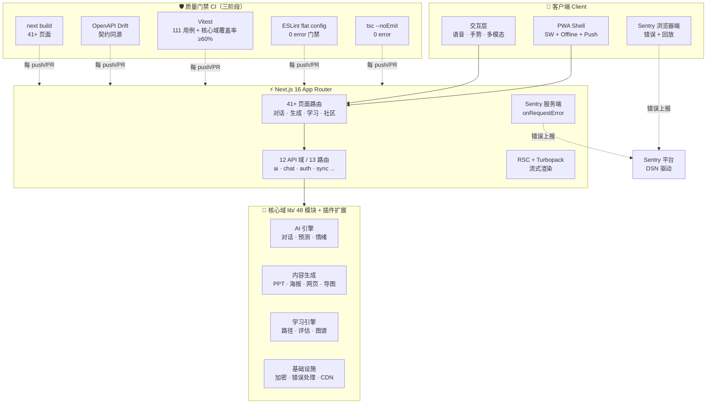
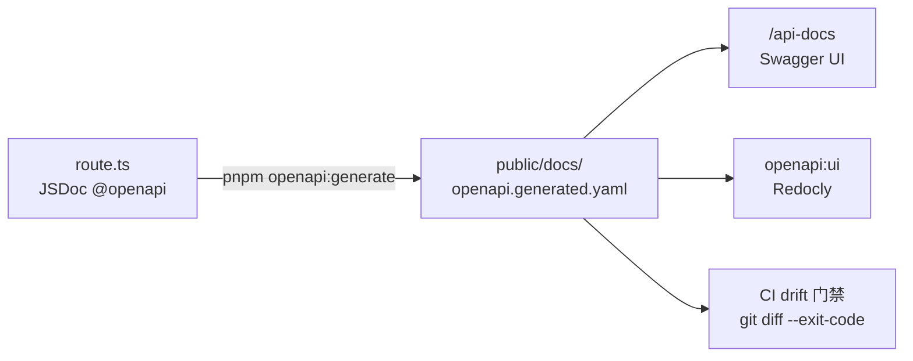

<div align="center">


# YYC³ NovaMind

### 星图智语 · 新一代 AI 全栈智能交互平台

**多模态 AI 对话 · 知识图谱 · 内容生成 · 学习路径 · 社区协作** —— 以「五维驱动」架构（五高 · 五标 · 五化）构建的全端 PWA 智能应用。

[](https://nextjs.org/)
[](https://react.dev/)
[](https://www.typescriptlang.org/)
[](https://tailwindcss.com/)
[](https://ui.shadcn.com/)
[](https://www.radix-ui.com/)
[](https://vitest.dev/)
[](https://sentry.io/)
[](https://pnpm.io/)

[](https://github.com/YYC-Cube/YYC3-Novamind/actions/workflows/ci.yml)
[](./package.json)
[](./eslint.config.mjs)
[](./lib/__tests__)
[](./public/docs/openapi.generated.yaml)
[](./vitest.config.ts)

[](./package.json)
[](#-快速开始)
[](./public/manifest.json)
[](./LICENSE)
[](./CONTRIBUTING.md)

</div>

---

## ✨ 特性总览

| 模块 | 能力 | 状态 |
| :----- | :----- | :----: |
| 🤖 AI 对话 | 多轮对话 · 流式响应 · 多模型支持 · 本地 LLM（Ollama 协议） | ✅ |
| 🧠 知识图谱 | 可视化图谱 · 智能关联 · 节点探索 | ✅ |
| 🗺️ 思维导图 | AI 生成 · 多主题 · 交互式编辑 | ✅ |
| 🎨 内容生成 | 海报 · PPT · 网页 · 一键生成 | ✅ |
| 📚 学习路径 | 个性化路径 · 进度追踪 · 评估系统 | ✅ |
| 👥 社区协作 | 内容分享 · 学习小组 · 实时协作 | ✅ |
| 📊 数据分析 | 使用分析 · 学习洞察 · 预测模型 | ✅ |
| 🔐 用户系统 | 注册登录 · 权限管理 · 安全认证 | ✅ |
| 🛡️ 可观测性 | Sentry 错误监控（DSN 驱动）· 契约漂移门禁 | ✅ |
| 📱 PWA | 离线支持 · 推送通知 · 全端安装 | ✅ |

---

## 🏗️ 技术架构

```
YYC³ NovaMind v2.0
├── Framework      Next.js 16 (App Router + RSC + Turbopack)
├── UI             React 19 + shadcn/ui + Radix UI
├── Styling        Tailwind CSS 3.4
├── Language       TypeScript 5.7 (Strict + 编译门禁 0 error)
├── State          React Hooks + Context
├── Forms          react-hook-form + zod
├── Charts         Recharts
├── AI             Vercel AI SDK 4 + @ai-sdk/openai 1 + 本地 LLM (Ollama 协议)
├── Icons          Lucide React (50+ UI components)
├── Testing        Vitest 2 + Testing Library 16 + Playwright 1.63
├── Monitoring     @sentry/nextjs 10 (DSN 驱动，双端 instrumentation)
├── API Contract   next-openapi-gen (JSDoc @openapi → OpenAPI 3.0 SSOT)
├── CI/CD          GitHub Actions (install → quality[lint+契约+单测] → build)
├── Package Mgr    pnpm 9
└── Deployment     Node.js ≥ 20.18 (CI 22) / Vercel
```

### 🗺️ 系统架构图



### 🔄 API 契约数据流（SSOT）



### 🎯 五维驱动架构

| 维度 | 核心实践 | 度量指标 |
| :----- | :----- | :----- |
| **高可用** | PWA Service Worker · 错误边界 · 优雅降级 | 99.9% 可用性 |
| **高性能** | 包导入优化 · RSC · 流式响应 · 图片优化(AVIF/WebP) | Lighthouse ≥ 90 |
| **高安全** | zod 校验 · 权限系统 · 数据加密 · CSP 安全头 | OWASP Top 10 覆盖 |
| **高扩展** | 模块化架构 · 插件系统 · API 路由 · 29 端点 | 模块复用率 ≥ 80% |
| **高智能** | AI 对话 · 知识图谱 · 预测模型 · 内容生成 | 多模型支持 |

---

## 📁 项目结构

```
yyc3-novamind/
├── app/                          # Next.js App Router
│   ├── api/                      # 12 API 域 / 13 路由 (29 @openapi 端点)
│   │   ├── ai/                   #   AI 接口
│   │   ├── chat/                 #   对话 (含 stream 流式)
│   │   ├── auth/                 #   认证接口
│   │   ├── sync/                 #   跨端同步
│   │   ├── upload/               #   文件上传
│   │   ├── speech-to-text/       #   语音识别
│   │   └── analyze-image/        #   图像分析
│   ├── api-docs/                 # Swagger UI 契约可视化
│   ├── auth/                     # 认证页面 (登录/注册/找回密码)
│   ├── search/                   # 智能搜索
│   ├── conversations/            # 对话管理
│   ├── knowledge-graph/          # 知识图谱
│   ├── learning-path/            # 学习路径
│   ├── generate/                 # 内容生成
│   │   ├── mindmap/              #   思维导图
│   │   ├── poster/               #   海报生成
│   │   ├── ppt/                  #   PPT 生成
│   │   └── webpage/              #   网页生成
│   ├── community/                # 社区
│   ├── analytics/                # 数据分析
│   ├── admin/                    # 管理后台
│   ├── settings/                 # 系统设置
│   └── layout.tsx                # 根布局
├── components/
│   ├── ui/                       # shadcn/ui 组件 (50+)
│   └── *.tsx                     # 业务组件 (协作/分析/主题)
├── lib/                          # 核心业务逻辑 (48 模块)
│   ├── __tests__/                #   单元测试 (111 用例)
│   └── _archive/                 #   归档区 (6 个月保留窗)
├── hooks/                        # 自定义 Hooks
├── openapi/                      # 契约源 (Zod schemas + 类型)
├── instrumentation.ts            # Sentry 服务端 (DSN 驱动)
├── instrumentation-client.ts     # Sentry 浏览器端
├── eslint.config.mjs             # ESLint flat config (0 error 门禁)
├── e2e/                          # Playwright E2E
├── docs/                         # YYC3-Docs 文档站 + 会话存档
├── public/
│   ├── docs/                     # openapi.generated.yaml (SSOT)
│   ├── yyc3-icons/               # 全端图标资源
│   │   ├── Android/              #   Android 多密度
│   │   ├── iOS/                  #   iOS 全尺寸
│   │   ├── Web App/              #   Web favicon + PWA
│   │   ├── macOS/                #   macOS 全尺寸
│   │   └── watchOS/              #   watchOS 全尺寸
│   ├── sw.js                     # Service Worker (PWA 离线)
│   ├── manifest.json             # PWA 清单
│   └── yyc3-Family.png           # 品牌 Family 图
├── package.json
├── tsconfig.json
├── vitest.config.ts              # 覆盖率双轨门禁
└── next.config.mjs
```

---

## 🚀 快速开始

### 环境要求

- Node.js ≥ 20.18.0（推荐 22，与 CI 一致）
- pnpm ≥ 9.0

### 安装

```bash
# 克隆项目
git clone https://github.com/YYC-Cube/YYC3-Novamind.git
cd YYC3-Novamind

# 安装依赖
pnpm install

# 启动开发服务器（默认端口 3218）
pnpm dev
```

访问 **<http://localhost:3218>**

### 常用命令

```bash
pnpm dev            # 开发服务器（端口 3218）
pnpm build          # 生产构建（Turbopack + TS 编译门禁）
pnpm start          # 启动生产服务（端口 3218）
pnpm typecheck      # TypeScript 严格编译门禁（0 error 基线）
pnpm lint           # ESLint flat config（0 error 门禁）
pnpm test           # Vitest 单元测试（111 用例）
pnpm test:watch     # Vitest 监听模式
pnpm test:coverage  # 覆盖率报告 + 双轨门禁（全局棘轮 + 核心域逐文件）
pnpm test:ui        # Vitest 交互式 UI
pnpm test:e2e       # Playwright E2E 测试
pnpm ci             # 全链路门禁：typecheck + lint + test + build
```

### 监控接入（Sentry，可选）

错误监控采用 **DSN 驱动**设计——不配置则完全静默，零开销：

```bash
cp .env.example .env.local   # 填入 NEXT_PUBLIC_SENTRY_DSN / SENTRY_DSN 即激活
```

### API 契约（SSOT 单源）

OpenAPI 契约由代码 JSDoc 注解自动生成，**禁止手工编辑**：

```bash
pnpm openapi:generate   # 从 route.ts JSDoc 生成 public/docs/openapi.generated.yaml
pnpm openapi:check      # 生成 + git diff 校验（CI drift 门禁同源）
pnpm openapi:ui         # Redocly 本地预览契约文档
```

- 在线 Swagger UI：启动开发服务器后访问 **<http://localhost:3218/api-docs>**
- 契约规范：所有 `app/api/**/route.ts` 必须携带 `@openapi` JSDoc 注解（GET/POST/PATCH/DELETE 全覆盖）

---

## 🎯 五维架构体系

YYC³ NovaMind 遵循 **五维驱动** 架构理念：

| 维度 | 实践 |
| :----- | :----- |
| **高可用** | PWA 离线支持 · 错误边界 · 优雅降级 |
| **高性能** | 包导入优化 · 按需编译 · 流式响应 |
| **高安全** | 表单验证(zod) · 权限系统 · 数据加密 |
| **高扩展** | 插件系统 · 模块化架构 · API 路由 |
| **高智能** | AI 对话 · 知识图谱 · 预测模型 · 内容生成 |

---

## 📚 开发者文档导航

| 文档 | 说明 |
| :----- | :----- |
| [CHANGELOG.md](./CHANGELOG.md) | 版本变更记录（v2.0.0 全量交付清单） |
| [CONTRIBUTING.md](./CONTRIBUTING.md) | 贡献流程与行为准则 |
| [docs/YYC3-Docs/](./docs/YYC3-Docs/) | MkDocs 文档站（架构 / CICD / 发布 / 风格指南） |
| [docs/yyc3-novamind-m3-20260918/](./docs/yyc3-novamind-m3-20260918/) | 会话四件套 + 全维度审核报告（79.5/100 · P0 已清零） |
| [.env.example](./.env.example) | 环境变量模板（Sentry / AI 服务） |
| `/api-docs`（dev 模式） | Swagger UI 在线契约 |

---

## 🤝 参与贡献

请阅读 [CONTRIBUTING.md](./CONTRIBUTING.md) 了解贡献流程和行为准则。

---

## 📄 许可证

本项目基于 [MIT License](./LICENSE) 开源。

---

<div align="center">

**YYC³ NovaMind** · 言启千行代码，语枢万物智能

*© 2026 YanYuCloudCube™ · 言启象限 | 语枢未来*

</div>
