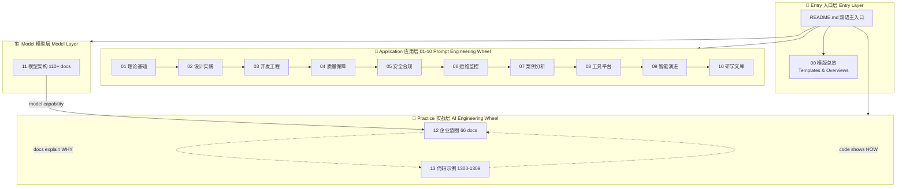
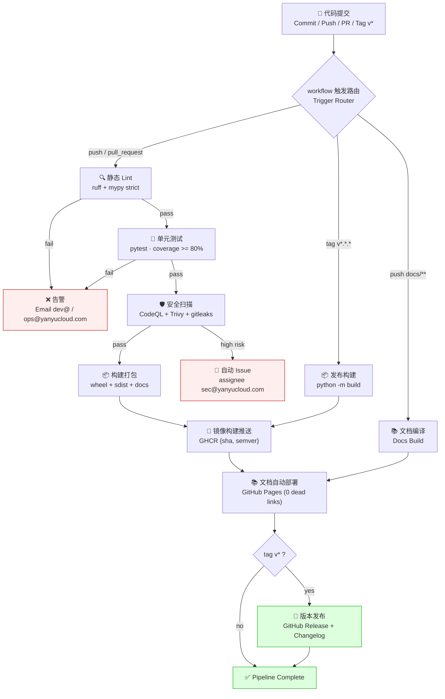

<div align="center">

# YYC³ · 生成式人工智能提示词工程

### YYC³ · Generative AI Prompt Engineering

**® YANYUCLOUDCUBE** · **言语（河南）智能科技有限公司**
**Yanyu Intelligent Technology Co., Ltd.**

[](./LICENSE)
[](https://github.com/YanYuCloudCube/YYC3-Prompt-Engineering/releases)
[](https://github.com/YanYuCloudCube/YYC3-Prompt-Engineering/stargazers)
[](https://github.com/YanYuCloudCube/YYC3-Prompt-Engineering/network/members)
[](https://github.com/YanYuCloudCube/YYC3-Prompt-Engineering/actions/workflows/ci.yml)
[](https://codecov.io/gh/YanYuCloudCube/YYC3-Prompt-Engineering)
[](https://github.com/YanYuCloudCube/YYC3-Prompt-Engineering/pkgs/container/yyc3)
[](https://yanyucloudcube.github.io/YYC3-Prompt-Engineering/)
[](https://github.com/YanYuCloudCube/YYC3-Prompt-Engineering/security/code-scanning)

*万象归元于云枢 | 深栈智启新纪元*
*All things converge in cloud pivot; Deep stacks ignite a new era of intelligence*

*言启千行代码 | 语枢万物智能*
*Words Inspire Thousands of Lines of Code; Language Pivots the Intelligence of All Things*

*言启象限 | 语枢未来*
*Words Initiate Quadrants, Language Serves as Core for Future*

</div>

---

## 📖 项目简介 | Introduction

**中文**：本仓库是 YANYUCLOUDCUBE 生成式人工智能提示词工程体系的开源主库——**14 大目录（00-13）、465+ 篇文档**，覆盖从理论基础、设计实践、开发工程到企业实战的全链路知识资产。配套 AI-Family 八智能体参考实现（1304）、协议栈标准化设计（MCP/A2A，1306/1207）、全栈可观测性（1308/1208）与安全合规治理（1307/1209），并以 CI/CD 流水线保障「文档讲 why、代码讲 how」的双轮驱动工程闭环。

**English**: This repository is the official open-source home of the YANYUCLOUDCUBE Generative AI Prompt Engineering system — **14 top-level directories (00-13), 465+ documents**, spanning the full knowledge chain from theory and design practice to enterprise battle-testing. It ships with the AI-Family eight-agent reference implementation (1304), standardized protocol stack (MCP/A2A, 1306/1207), full-stack observability (1308/1208), and security & compliance governance (1307/1209), all wired through a CI/CD pipeline that closes the loop of *"docs explain why, code shows how"*.

## ✨ 核心特性 | Core Features

| # | 中文 | English |
| --- | ------ | --------- |
| 1 | **双框架方法论**：CO-STAR 六要素 + CRAFT 五维质量框架，18 分制量化评审 | **Dual Framework**: CO-STAR six elements + CRAFT five-dimension quality, quantified by an 18-point rubric |
| 2 | **三层双轮驱动架构**：应用层（00-10）× 模型层（11）× 实战层（12-13） | **Three-Layer Dual-Wheel Architecture**: Application (00-10) × Model (11) × Practice (12-13) |
| 3 | **AI-Family 八智能体**：元启/言启/语枢/预见/知遇/智云/格物/创想，BaseAgent 契约化实现 | **AI-Family Eight Agents**: contract-driven via `BaseAgent`, from commander to creator |
| 4 | **协议栈标准化**：MCP 工具连接 + A2A 六状态机通信 + 传输层选型指南 | **Protocol Stack**: MCP tool connectivity + A2A six-state machine + transport selection guide |
| 5 | **全栈可观测性**：结构化日志 / SLO 错误预算 / W3C Trace 分布式追踪 | **Full-stack Observability**: structured logs / SLO error budgets / W3C distributed tracing |
| 6 | **安全合规治理**：零信任架构 / 提示词注入防护 / 内容三级过滤 / 事件响应 SOP | **Security & Governance**: zero trust / prompt-injection defense / 3-tier content filter / incident SOP |
| 7 | **双语规范**：中文在上、英文在下的双语文档标准贯穿全库 | **Bilingual Standard**: Chinese-first, English-second documentation across the repo |
| 8 | **工程化流水线**：Lint → Test → Scan → Build → Publish → Docs → Release 全自动 | **Engineering Pipeline**: Lint → Test → Scan → Build → Publish → Docs → Release, fully automated |

## 📦 环境前置依赖 | Prerequisites

| 依赖 Dependency | 最低版本 Min Version | 用途 Purpose |
| ----------------- | --------------------- | -------------- |
| Git | 2.40+ | 版本管理 Version control |
| Python | 3.10+ | 运行 13 目录代码示例 Run code examples (dir 13) |
| Node.js + pnpm | 18+ / 8+ | 文档工具链（可选）Docs toolchain (optional) |
| Docker | 24+ | 容器化构建与本地编排 Container builds & local compose |
| GNU Make | 4.0+ | 任务入口 Task entrypoint |

## 🚀 快速开始 | Quick Start

**安装 | Install**

```bash
git clone https://github.com/YanYuCloudCube/YYC3-Prompt-Engineering.git
cd YYC3-Prompt-Engineering
python -m venv .venv && source .venv/bin/activate
pip install -r requirements.txt   # 13 目录示例依赖 Example deps for dir 13
```

**最小示例 | Minimal Example**

```python
# 1300 · 提示词引擎：CO-STAR 六要素渲染
# 1300 · Prompt Engine: render a prompt with the CO-STAR framework
from prompt_engine import PromptEngine   # 13-.../1300-代码示例-核心基础设施/prompt-engine/

engine = PromptEngine()
prompt = engine.build_co_star(
    context="企业知识库助手 Enterprise KB assistant",
    objective="生成结构化会议纪要 Produce structured meeting minutes",
    scope="仅限本次会议内容 Current meeting content only",
    task="提取决议、行动项与风险 Extract decisions, action items, risks",
    audience="部门负责人 Department heads",
    response="Markdown 三段式 Markdown, three sections",
)
print(prompt)
```

**本地门禁 | Local gates**

```bash
make lint    # ruff + mypy
make test    # pytest + coverage (gate: >= 80%)
```

## 🏷️ 仓库标签规范 | Labeling Policy【新增 | New】

> 完整定义与机器可读清单见 [`docs/LABELS.md`](./docs/LABELS.md) 与 [`.github/labels.json`](./.github/labels.json)。
> Full definitions & machine-readable sync file: [`docs/LABELS.md`](./docs/LABELS.md) + [`.github/labels.json`](./.github/labels.json).

**类型标签 | Type Labels**

| Label | 中文说明 | English |
| ------- | --------- | --------- |
| `feature` | 新功能 | New feature |
| `enhancement` | 现有功能增强 | Enhancement to existing behavior |
| `bug` | 缺陷 | Defect / regression |
| `documentation` | 文档与知识库 | Docs & knowledge base |
| `performance` | 性能优化 | Performance improvement |
| `security` | 安全与合规 | Security & compliance |
| `ci` | CI/CD 流水线 | Pipeline & tooling |
| `breaking-change` | 破坏性变更 | Breaking change (requires migration notes) |

**优先级 | Priority**: `priority:critical (P0)` · `priority:high (P1)` · `priority:medium (P2)` · `priority:low (P3)`

**状态 | Status**（维护者专用 | maintainer-only）: `status:triaged` · `status:in-progress` · `status:blocked` · `status:needs-review` · `status:awaiting-feedback` · `status:duplicate` · `status:wontfix`

**模块 | Module**: `mod:00` … `mod:13`（按目录编号 by directory code）· `mod:infra` · `mod:docs`

**使用规则 | Rules**

1. 提交 Issue **必选**：1 个类型 + 1 个模块 + 1 个优先级；不确定时加 `status:needs-triage`。
   Every Issue **must** carry one type + one module + one priority; add `status:needs-triage` when unsure.
2. 提交 PR **必选**：类型 + 模块标签；标题遵循 Conventional Commits（`feat:`/`fix:`/`docs:`/`ci:`…）。
   Every PR **must** carry type + module labels; titles follow Conventional Commits.
3. `breaking-change` 必须叠加 `priority:critical|high`，并在 PR 描述提供迁移说明。
   `breaking-change` requires `priority:critical|high` plus a migration note in the PR body.
4. 状态标签仅维护者维护，贡献者请勿添加/修改。
   Status labels are maintainer-managed; contributors shall not add or alter them.
5. 单个 Issue 主类型唯一；模块标签可叠加但 ≤ 3 个。
   One primary type per Issue; up to 3 module labels allowed.

## 📚 文档体系说明 | Documentation System

本库采用「三层双轮驱动」架构：入口层（README + 00 模版总览）→ 应用层（01-10）→ 模型层（11）→ 实战层（12 企业蓝图 + 13 代码示例）；双轮 = 提示词工程 × AI 工程化互为驱动。
The repo follows a "three-layer, dual-wheel drive" architecture: Entry (README + 00 templates) → Application (01-10) → Model (11) → Practice (12 blueprints + 13 code), with Prompt Engineering × AI Engineering as the twin wheels.



> 可视化技术规范（配色/字体/图表规则）见 [`docs/STYLE-GUIDE.md`](./docs/STYLE-GUIDE.md)。
> Visualization conventions (colors/fonts/diagram rules): [`docs/STYLE-GUIDE.md`](./docs/STYLE-GUIDE.md).

## 🧩 API 简述 | API Overview

| 模块 Module | 入口 Entry | 说明 Description |
| ------------- | ----------- | ----------------- |
| PromptEngine | `13/1300/prompt-engine` | CO-STAR + CRAFT 提示词渲染引擎 Prompt rendering engine |
| BaseAgent | `13/1304` | 八智能体契约基类（handle_task / healthz / describe）Agent contract base class |
| MCPClient / Server | `13/1306/MCP` | 工具连接协议（stdio/SSE/HTTP）Tool connectivity protocol |
| A2AClient | `13/1306/A2A` | Agent 通信六状态机（submitted→completed）Agent-to-agent six-state machine |
| ContentFilter | `13/1307/content_filter.py` | 三级内容过滤（L0-L3）3-tier content filter |
| TelemetrySDK | `13/1308/telemetry` | OTel 遥测（Logs/Metrics/Traces）OTel telemetry SDK |

> 完整接口规范见 `13-YYC3-企业蓝图-代码示例/YYC3-AI-Family-全场景API文档.md`。
> Full API specs: `13-YYC3-企业蓝图-代码示例/YYC3-AI-Family-全场景API文档.md`.

## 🛠️ 开发指南 | Development Guide

- **分支模型 Branching**: `main`（保护 protected）← `develop` ← `feat/*` / `fix/*` / `docs/*` / `ci/*`
- **提交规范 Commits**: Conventional Commits（`feat|fix|docs|perf|refactor|test|ci|chore`）
- **本地门禁 Local gates**: `make lint && make test`（CI 同款 same as CI）
- **钩子 Hooks**: `pre-commit install`（ruff · mypy · gitleaks 三闸 three gates）
- **文档构建 Docs build**: `make docs`（本地预览 local preview）/ `docs/**` 变更自动触发部署 auto-deploy on change

> 详细规范见 [`CONTRIBUTING.md`](./CONTRIBUTING.md)。Details: [`CONTRIBUTING.md`](./CONTRIBUTING.md).

## ⚙️ CI/CD 流水线 | CI/CD Pipeline【新增 | New】

> 完整说明见 [`docs/CICD.md`](./docs/CICD.md)；工作流定义 `.github/workflows/{ci,release,docs}.yml`。
> Full reference: [`docs/CICD.md`](./docs/CICD.md); workflow sources at `.github/workflows/{ci,release,docs}.yml`.

**触发规则 | Triggers**

| 事件 Event | 工作流 Workflow | 说明 Description |
| ----------- | ---------------- | ------------------ |
| `push` → `main` / `develop` | `ci.yml` | 全量门禁 Full gates（lint/test/scan/build） |
| `pull_request` → `main` | `ci.yml` | PR 必需状态检查 Required status checks |
| `push` tag `v*.*.*` | `release.yml` | 版本发布流水线 Release pipeline |
| `push` → `main`（`docs/**`） | `docs.yml` | 文档自动编译部署 Docs compile & deploy |

**流水线阶段 | Stages**

| # | 阶段 Stage | 工具 Tooling | 通过标准 Gate |
| --- | ----------- | -------------- | --------------- |
| 1 | 静态检查 Lint | ruff + mypy strict | 0 errors |
| 2 | 单元测试 Unit Test | pytest + coverage | 100% pass · coverage ≥ 80% |
| 3 | 安全扫描 Security Scan | CodeQL + Trivy + gitleaks | 无高危 High = 0 |
| 4 | 构建打包 Build | `python -m build` / docs compile | 制品完整 Artifacts ok |
| 5 | 镜像推送 Image Publish | docker → GHCR | 多标签 tags `{sha, semver}` |
| 6 | 文档部署 Docs Deploy | GitHub Pages (mkdocs-material) | 构建零死链 0 dead links |
| 7 | 版本发布 Release | GitHub Releases | tag `v*` 触发，附 Changelog |

**失败告警 | Failure Alerts**: CI 失败邮件 `dev@yanyucloud.com` / `ops@yanyucloud.com`；Release 失败通知 `admin@yanyucloud.com`；高危漏洞自动建 Issue 指派 `sec@yanyucloud.com`；可选 Slack/钉钉 Webhook。
CI failures email `dev@` & `ops@`; release failures page `admin@`; high-severity findings auto-open an Issue for `sec@`; Slack/DingTalk webhook optional.

**分支保护 | Branch Protection**: `main` 强制 PR + ≥1 审批 + 必需检查（lint / unit-test / security-scan / coverage）+ 禁 force-push + 线性历史；`develop` 必需检查通过方可合并；`v*` 标签仅维护者可创建。
`main` requires PR + 1 approval + required checks + no force-push + linear history; `develop` requires green checks; `v*` tags are maintainer-only.

**制品存储 | Artifacts**: 镜像 → `ghcr.io/yanyucloudcube/yyc3:{sha, semver}`；发布制品（wheel / docs tarball）→ GitHub Releases（永久保留 retained forever）；覆盖率 → Codecov + Actions 制品（保留 30 天 30-day retention）。



## 📋 仓库目录说明 | Repository Layout

| 目录 Dir | 主题 Theme | 说明 Description |
| --------- | ----------- | ------------------ |
| `00` | 模版总览 Templates | 五类模版 + 六篇总纲 5 template sets + 6 overviews |
| `01`-`07` | 应用层 Application | 理论/设计/开发/质量/安全/运维/案例 Theory→Design→Dev→QA→Security→Ops→Cases |
| `08`-`10` | 工程支撑 Tooling | 工具平台/智能演进/研学文库 Tools / Evolution / Library |
| `11` | 模型架构 Model | 110+ 篇模型与推理架构 110+ model & inference docs |
| `12` | 企业蓝图 Blueprints | 管理智能化 + 规范/协议/观测/安全/手册 Blueprints & handbooks |
| `13` | 代码示例 Code | 1300-1309 参考实现 + 测试套件 Reference implementations & test suites |
| `.build/` | 构建辅助 Build helpers | 校验与审计脚本 Verify & audit scripts |
| `docs/` | 开发者文档 Dev docs | 架构/CI/标签/发布/风格规范 Architecture/CI/Labels/Release/Style |
| `YYC3-Docs/` | 文档源仓 Docs source | 本目录 this directory（可整体作为站点源 mkdocs site source） |

## 🤝 贡献指南 | Contributing

1. **认领任务 Pick an issue**: 按 🏷️ 标签规范筛选 `bug`/`feature`/`documentation`，评论认领。
   Filter issues by labels per the Labeling Policy and claim via comment.
2. **派生分支 Branch**: `git checkout -b feat/your-topic develop`
3. **提交 PR**: 勾选类型 + 模块标签；CI 全绿后请求 review；`breaking-change` 走维护者双人评审。
   Open a PR with type + module labels; request review once CI is green; breaking changes need two maintainer approvals.
4. **合并 Merge**: squash merge 至 `develop`；`main` 仅接受 release PR。
   Squash-merge into `develop`; `main` accepts release PRs only.
5. 提交即代表您同意按 **Apache-2.0** 许可贡献代码。
   By contributing you agree your work is licensed under Apache-2.0.

> 完整流程见 [`CONTRIBUTING.md`](./CONTRIBUTING.md)；行为准则见 [`CODE_OF_CONDUCT.md`](./CODE_OF_CONDUCT.md)。
> Full workflow: [`CONTRIBUTING.md`](./CONTRIBUTING.md); Code of Conduct: [`CODE_OF_CONDUCT.md`](./CODE_OF_CONDUCT.md).

## 📮 联系方式 | Contact

| 邮箱 Email | 用途 Purpose |
| ----------- | -------------- |
| <dev@yanyucloud.com> | 开发通用 Development general |
| <docs@yanyucloud.com> | 文档与知识库 Docs & knowledge base |
| <admin@yanyucloud.com> | 管理员 Administration |
| <ops@yanyucloud.com> | 运维 Operations |
| <support@yanyucloud.com> | 技术支持 Technical support |
| <api@yanyucloud.com> | API 接口相关 API related |
| <sec@yanyucloud.com> | 安全报告 Security reports（请勿公开披露 Please do not disclose publicly） |

## ⚖️ 开源协议声明 | License

本项目代码以 **Apache License 2.0** 发布（见 [LICENSE](./LICENSE)）；文档内容以 **CC BY-SA 4.0** 授权。
Code is released under the **Apache License 2.0** (see [LICENSE](./LICENSE)); documentation is licensed under **CC BY-SA 4.0**.

`YANYUCLOUDCUBE`、`YYC³` 及相关标识为言语（河南）智能科技有限公司注册商标/商标，协议授权不包含商标使用权。
`YANYUCLOUDCUBE`, `YYC³` and related marks are trademarks of Yanyu Intelligent Technology Co., Ltd.; the licenses do not grant trademark rights.

---

<div align="center">

*万象归元于云枢 | 深栈智启新纪元*
*All things converge in cloud pivot; Deep stacks ignite a new era of intelligence*

**© 2025-2026 言语（河南）智能科技有限公司 · Yanyu Intelligent Technology Co., Ltd.**
**® YANYUCLOUDCUBE. All Rights Reserved.**

</div>
