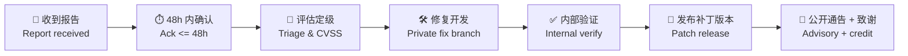

# 安全策略 | Security Policy

> **报告漏洞 | Report a Vulnerability**: [创建私密安全通告 Open a private security advisory](https://github.com/YanYuCloudCube/YYC3-Prompt-Engineering/security/advisories/new) 或邮件 **sec@yanyucloud.com**
> **公开渠道 | Public channel**: 请勿在 Issue/PR 中披露未修复的漏洞 Do not disclose unfixed vulnerabilities in public issues.

## 支持版本 | Supported Versions

| 版本 Version | 支持状态 Status | 安全补丁 Security Fixes |
|--------------|----------------|:---:|
| latest (`main` / 最新 Release) | ✅ Full | ✅ |
| 前 1 个 minor（如 `N-1`） | ✅ Maintenance | ✅ |
| 更早版本 Earlier | ❌ EOL | ❌ |

## 报告内容 | What to Include

1. 漏洞类型与影响面 Vulnerability type & impact scope
2. 复现步骤（含最小 PoC，请脱敏）Repro steps (minimal, sanitized PoC)
3. 受影响版本 / 提交 Affected versions / commit SHA
4. 修复建议（如有）Suggested fix if any

## 响应流程 | Response Process

| 阶段 Stage | 目标时限 Target SLA |
|-----------|-------------------|
| 确认收到 Acknowledgement | ≤ 48 小时 hours |
| 初步评估 Initial assessment | ≤ 7 天 days |
| 高危修复 High-severity fix | ≤ 30 天 days |
| 公开通告 Public disclosure | 补丁发布后 90 天内 within 90 days after patch |

## 严重度处理 | Severity Handling

| CVSS | 处置 Handling |
|------|--------------|
| 9.0-10.0 Critical | 立即应急：冻结发布窗 + 热修 + 全员通告 Immediate hotfix, freeze, broadcast |
| 7.0-8.9 High | 30 天内补丁，扫描器自动建 Issue 指派 sec@ Patch in 30d, auto-issue to sec@ |
| 4.0-6.9 Medium | 下一例行版本 Next regular release |
| 0.1-3.9 Low | 积压清单 Backlog |

## 安全编码基线 | Secure Coding Baseline

- 密钥/凭证仅经环境变量或 Vault 注入，仓库内零硬编码（gitleaks 闸强制）
  Secrets via env/Vault only; zero hardcoding (enforced by gitleaks gate)
- 提示词模板必须嵌入安全 System Prompt（`Security Constraints` 段）
  Prompt templates must embed the `Security Constraints` block
- 用户输入/RAG 文档/工具响应三入口均接注入检测
  Injection detection on all three inputs: user text, RAG docs, tool responses
- 依赖锁定（lockfile）+ 每周自动化漏洞扫描（Trivy / Dependabot）
  Pinned deps + weekly automated scans (Trivy / Dependabot)

---

**® YANYUCLOUDCUBE** · © 2025-2026 言语（河南）智能科技有限公司 · Yanyu Intelligent Technology Co., Ltd.

