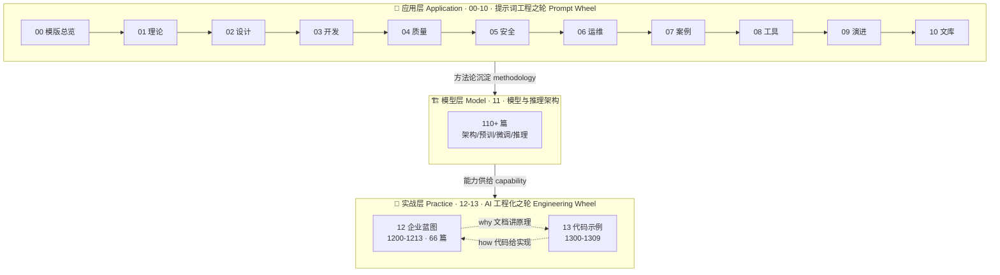
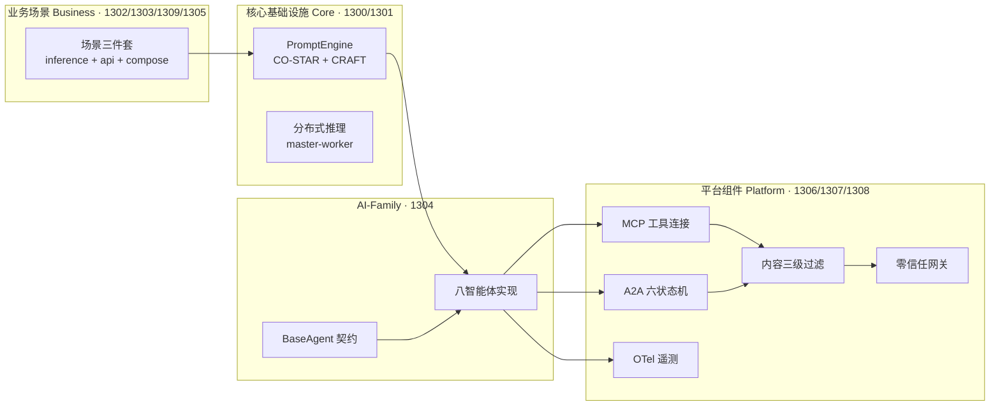

# 架构总览 | Architecture Overview

> 版本 v1.0.0 · 2026-09-16 · 维护者 docs@yanyucloud.com

## 一、三层双轮驱动 | Three-Layer Dual-Wheel Drive

## 二、13 目录代码资产图 | Directory 13 Code Assets

## 三、关键设计决策 | Key Design Decisions

| 决策 Decision | 选择 Choice | 理由 Rationale |
|---------------|------------|----------------|
| Agent 通信 | A2A 星型拓扑（经元启编排） | 集中治理、审计单点、避免网状依赖 Hub governance & audit |
| 工具接入 | MCP 标准协议 | 生态即插即用 Plug-and-play ecosystem |
| 身份安全 | SPIFFE ID + SVID 短期证书 | 零信任、1h 自动轮换 Zero-trust, auto-rotation |
| 观测标准 | OTel + W3C Trace | 厂商中立 Open standards |
| 提示词质量 | CO-STAR 结构 + CRAFT 五维量化 | 可评审、可回归 Reviewable & regression-able |
| 文档语言 | 中文在上/英文在下双语 | 中文为母本，英文为传播面 Bilingual by design |

## 四、目录编号规则 | Numbering Convention

- **四位数目录**: `1300-1309`（13 章模块）、`00-13`（顶级章节）
  Four-digit module codes; two-digit top-level chapters
- **六位数文档**: `120601` = 目录 `12` + 子目录 `06` + 序号 `01`
  Six-digit doc ID = chapter + subdirectory + sequence
- **唯一性红线**: 一个编号只对应一个模块（参考 `1304`/`1309` 拆分先例）
  One code, one module (see the 1304/1309 split precedent)

---

**® YANYUCLOUDCUBE** · © 2025-2026 言语（河南）智能科技有限公司

