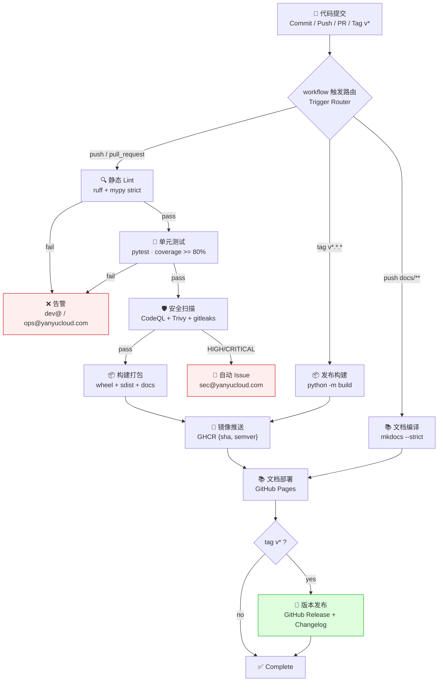

# CI/CD 流水线详解 | CI/CD Pipeline Reference

> 版本 v1.0.0 · 2026-09-16 · 工作流源码 `.github/workflows/{ci,release,docs}.yml`

## 一、全景流程图 | End-to-End Flow



## 二、工作流矩阵 | Workflow Matrix

| 工作流 | 触发 Trigger | Job 链 Chain | 备注 Notes |
|--------|-------------|--------------|-----------|
| `ci.yml` | push → main/develop; PR → main/develop | lint → unit-test → security-scan → build → docker → notify | PR 上不推镜像 docker skipped on PRs |
| `release.yml` | tag `v*.*.*` | release-build → release-publish → release-notify | environment: production |
| `docs.yml` | push → main (`docs/**`, `**.md`) | build → deploy (GitHub Pages) | `--strict` 零死链 zero dead links |

## 三、门禁标准 | Gate Standards

| 阶段 | 工具 | 失败条件 Fail when |
|------|------|-------------------|
| Lint | ruff / mypy | 任何 error（warning 放行 warnings allowed） |
| Unit Test | pytest + coverage | 用例失败 或 coverage < 80% |
| Security | gitleaks / Trivy / CodeQL | 命中密钥 / HIGH+ 漏洞 / 高危告警 |
| Docs | mkdocs --strict | 死链或构建警告 |

## 四、失败告警 | Failure Alerts

| 场景 Scenario | 通道 Channel |
|---------------|-------------|
| CI 任一 job 失败 | Email → dev@yanyucloud.com, ops@yanyucloud.com（+ 可选 Webhook） |
| Release 失败 | Email → admin@yanyucloud.com |
| 安全高危 | 自动 Issue → assignee sec@yanyucloud.com |

## 五、分支保护策略 | Branch Protection

**`main`**:
- Require pull request + 1 approval
- Required checks: `lint` / `unit-test` / `security-scan` / `build`
- Dismiss stale approvals · require linear history · no force-push
- Restrictions: 仅维护者可推送 only maintainers push

**`develop`**: required checks（lint / unit-test / security-scan）通过即可合并 mergeable when green

**Tags**: `v*` 模式仅维护者可创建 maintainer-only creation

## 六、制品存储与保留 | Artifacts & Retention

| 制品 Artifact | 位置 Location | 保留 Retention |
|---------------|--------------|----------------|
| Docker 镜像 | `ghcr.io/yanyucloudcube/yyc3:{sha, semver, latest}` | 随版本 versions |
| 发布制品 wheel/sdist | GitHub Releases | 永久 forever |
| 覆盖率 coverage.xml | Codecov + Actions artifact | 30 天 days |
| 站点 site/ | GitHub Pages | 最新版 latest |

## 七、本地等价命令 | Local Equivalents

```bash
make lint && make test && make security && make docs-build
```

> CI 与本地使用同版本工具链（`requirements-dev.txt` 锁定），确保「本地绿 = CI 绿」。
> Same pinned toolchain locally and in CI: green locally means green in CI.

---

<div align="center">**® YANYUCLOUDCUBE** · © 2025-2026 言语（河南）智能科技有限公司</div>
