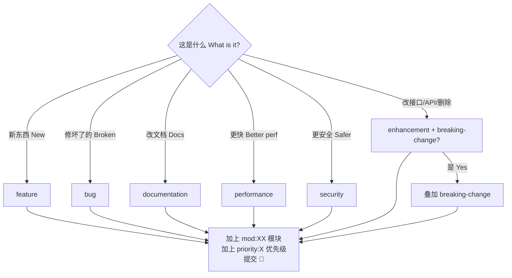

# 标签规范详解 | Label Policy Reference

> 版本 v1.0.0 · 2026-09-16 · 机器可读清单 `.github/labels.json`（可用 [github-label-sync](https://github.com/Financial-Times/github-label-sync) 一键同步）
> 标签疑问 label questions: <dev@yanyucloud.com>

## 一、标签分类 | Taxonomy

### 1.1 类型标签 | Type Labels（主类型唯一 unique primary）

| Label | 颜色 Color | 中文 | English |
| ------- | ----------- | ------ | --------- |
| `feature` | 🟩 `0E8A16` | 新功能 | New feature |
| `enhancement` | 🟦 `A2EEEF` | 功能增强 | Enhancement |
| `bug` | 🟥 `D73A4A` | 缺陷 | Defect / regression |
| `documentation` | 🟦 `0075CA` | 文档 | Docs & KB |
| `performance` | 🟧 `FB9050` | 性能 | Performance |
| `security` | 🟥 `B60205` | 安全 | Security & compliance |
| `ci` | 🟦 `1D76DB` | 流水线 | Pipeline & tooling |
| `breaking-change` | 🟧 `D93F0B` | 破坏性变更 | Breaking change |

### 1.2 优先级 | Priority（恰好一个 exactly one）

| Label | 含义 | 响应目标 SLO |
| ------- | ------ | ------------- |
| `priority:critical` | P0 阻断生产 | 立即立即应急 immediate |
| `priority:high` | P1 当迭代 | 本迭代内 within sprint |
| `priority:medium` | P2 排期 | 2 个迭代内 within 2 sprints |
| `priority:low` | P3 积压 | 择期 backlog |

### 1.3 状态 | Status（仅维护者 maintainer-only）

`status:needs-triage` → `status:triaged` → `status:in-progress` → `status:needs-review` → ✅ 关闭 closed

旁路 bypass: `status:blocked` / `status:awaiting-feedback` / `status:duplicate` / `status:wontfix`

### 1.4 模块 | Module（≤ 3 个可叠加 stackable）

- `mod:00` … `mod:13` —— 按章节目录 by chapter directory
- `mod:infra` —— 工作流/脚本 workflows & scripts
- `mod:docs` —— 开发者站点文档 developer site docs

### 1.5 社区 | Community

`good-first-issue` · `help-wanted` · `hacktoberfest`

## 二、使用规则 | Usage Rules

1. **Issue 必选**: 1 类型 + 1 模块 + 1 优先级；模板会预置 `status:needs-triage`。
   Issue requires: type + module + priority; templates pre-set `status:needs-triage`.
2. **PR 必选**: 1 类型 + 1 模块；标题 = Conventional Commits。
   PR requires: type + module; title follows Conventional Commits.
3. **breaking-change**: 叠加 `priority:critical|high` + 迁移说明。
   Add high priority + migration notes.
4. **状态标签**: 贡献者勿动，维护者流转。
   Status labels are maintainer-managed.
5. **合并约束**: PR 合并前必须 ≥ 1 类型 + 1 模块标签（CI 可扩展校验）。
   Merging requires at least type + module labels.

## 三、决策速查 | Quick Decision Tree

---

**® YANYUCLOUDCUBE** · © 2025-2026 言语（河南）智能科技有限公司

