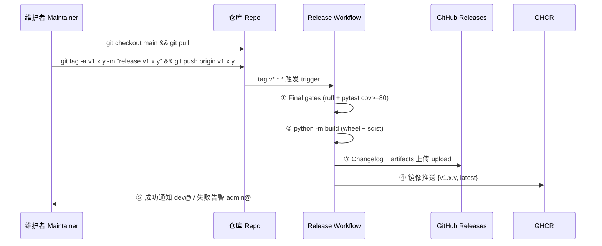

# 发布流程 | Release Process

> 版本 v1.0.0 · 2026-09-16 · 版本语义 SemVer 2.0.0 · 触发方式 tag-driven
> 维护联系 maintainer contact: <admin@yanyucloud.com> · 发布失败告警 failure alerts: <admin@yanyucloud.com>

## 一、版本语义 | Versioning Semantics

```text
v MAJOR . MINOR . PATCH
   │       │       └─ 修复/笔误 bug fixes, typos
   │       └─ 新功能/新文档 new features, new docs
   └─ 破坏性变更 breaking changes（必须附迁移说明 with migration notes）
```

- 预发布 Pre-release: `v2.0.0-rc.1` / `v1.1.0-beta.2`（Release 页标记 prerelease）
- 构建元数据: `+build.sha`（仅内部标识，不参与优先级比较）

## 二、发布前置检查单 | Pre-Release Checklist

- [ ] `develop` → `main` 的 release PR 已评审（≥1 approval）
      Release PR from `develop` to `main` reviewed
- [ ] CHANGELOG.md 已更新本版本条目（Added/Changed/Fixed/Removed/Security）
      CHANGELOG updated for this version
- [ ] CI 在 `main` 上全绿 All CI checks green on `main`
- [ ] 版本号已按语义提升 Version bumped per SemVer
- [ ] `breaking-change` 条目均有迁移文档 Breaking entries have migration docs

## 三、发布流程 | Release Flow



**命令速查 | Command quickref**

```bash
# 1. 确认 main 就绪 ensure main is green
git checkout main && git pull && gh run watch

# 2. 打标签并推送 tag & push
git tag -a v1.0.1 -m "release v1.0.1" && git push origin v1.0.1

# 3. 观察发布流水线 watch the pipeline
gh run watch
```

## 四、发布后动作 | Post-Release

1. 核对 Release 页制品完整性（wheel / sdist / changelog）Verify artifacts
2. 拉取 `ghcr.io/yanyucloudcube/yyc3:v1.x.y` 做冒烟 Smoke-test the image
3. 向 <dev@yanyucloud.com> 群发版本通告 Broadcast announcement
4. 回填 `develop`：`git checkout develop && git merge main`（或 cherry-pick 版本提交）
   Back-merge into `develop`

## 五、回滚 | Rollback

| 场景 Scenario | 动作 Action |
| --------------- | ------------ |
| 镜像缺陷 Image defect | 部署回退上一 tag 的镜像 `vN-1`（latest 重新指钉 repin latest） |
| Release 内容有误 Wrong release | 删除 Release + tag，修复后以**新版本号**重发；禁止复用已发布版本号 Delete release & tag, re-issue with a NEW version — never reuse |
| 文档站点异常 Docs site broken | 重跑 `docs.yml`（workflow_dispatch）；严重时回滚 Pages 至上一 artifact |

---

<div align="center">**® YANYUCLOUDCUBE** · © 2025-2026 言语（河南）智能科技有限公司</div>
