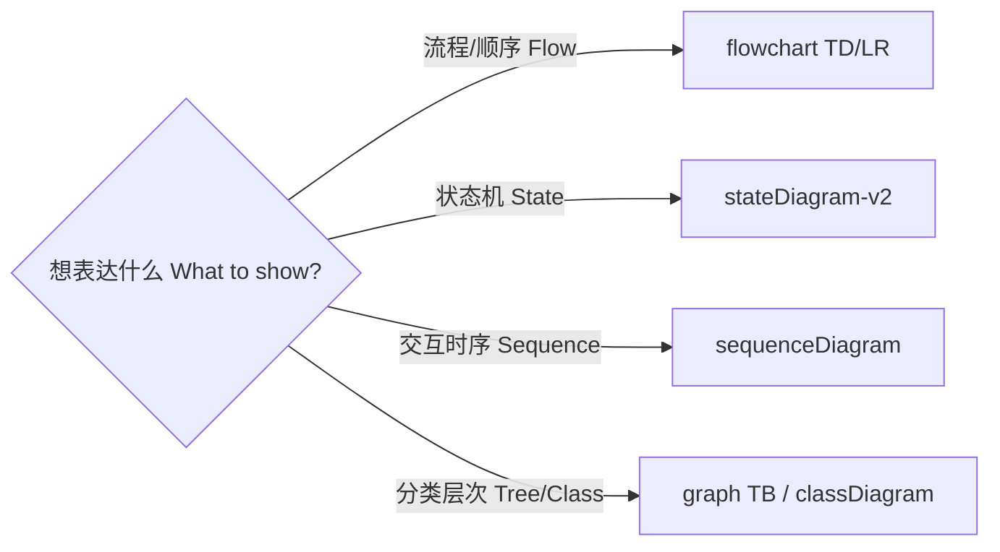

# 文档风格指南 | Documentation Style Guide

> 版本 v1.0.0 · 2026-09-16 · 全库文档写作与可视化统一规范 Unified writing & visualization standard
> 规范咨询 style questions: <docs@yanyucloud.com>

## 一、双语规范 | Bilingual Rules

1. **段落顺序**: 中文在上，English 紧随其下（表格内可并列双语列）。
   Chinese paragraph first, English right below (parallel columns in tables).
2. **保持英文的元素**: 代码、命令、标签名、徽章、Mermaid 图内文本、文件路径、frontmatter。
   Always English: code, commands, labels, badges, Mermaid node text, paths, frontmatter.
3. **术语表 Terminology**:

| 中文 | English | 备注 Notes |
| ------ | --------- | ----------- |
| 提示词工程 | Prompt Engineering | — |
| 智能体 | Agent | 八智能体 eight agents |
| 企业蓝图 | Enterprise Blueprint | 12 章 chapter 12 |
| 生成式人工智能 | Generative AI | — |
| 五高五标五化 | Five-High / Five-Standard / Five-Transformation | YYC³ 方法论 methodology |

## 二、Markdown 结构规范 | Structure Rules

```markdown
# 唯一 H1（标题含编号 e.g. 120601 - 提示词注入防护）
> 版本 v1.0.0 · 日期 · 维护者 Maintainer

## 一、章节 Chinese-numbered H2 (一、二、三…)
### 1.1 子节 numeric H3

正文段落 < 120 字/段 paragraphs under 120 chars
列表用 -，任务用 - [ ]
```

- **frontmatter 必填**（内容文档）: `file / description / author / version / created / updated / status / tags / category`
- **编号**: 六位数字 `120601`；模块索引固定 `README.md`
- **链接**: 站内相对路径；禁止裸 URL（站点零死链门禁 `mkdocs --strict`）
- **每篇收尾**: 页脚版权行 `**® YANYUCLOUDCUBE** · © 2025-2026 言语（河南）智能科技有限公司`

## 三、可视化规范 | Visualization Conventions

### 3.1 图类型选择 | Diagram Type Picker



### 3.2 配色令牌 | Color Tokens（全库统一 repo-wide）

| 语义 Semantics | Mermaid 写法 | 十六进制 |
| ---------------- | ------------- | --------- |
| 成功/通过 success | `fill:#dfd,stroke:#0a0` | `#dfd` / `#0a0` |
| 失败/告警 failure | `fill:#fee,stroke:#c00` | `#fee` / `#c00` |
| 强调/决策 emphasis | 默认主题默认色 default theme | — |

### 3.3 节点命名 | Node Naming

- 节点文本：`图标 + 英文名 + 关键参数`（如 `🔍 Lint · ruff + mypy`）
  Node text: icon + English + key params
- 分支标签：`pass` / `fail` / `yes` / `no`（小写英文）
  Branch labels in lowercase English
- 一张图节点 ≤ 15 个；超限拆分子图 subgraph 分层
  Max 15 nodes per diagram; split with subgraphs

### 3.4 代码块规范 | Code Block Rules

- Python/SQL/YAML/Dockerfile：标注语言键；命令块加注释行说明用途
  Always specify language; comment the purpose of command blocks
- 每段示例可直接复制运行（禁止伪代码当示例 pseudo-code is not an example）

## 四、徽章规范 | Badge Rules

- 徽章统一置于 README 顶部居中容器 `<div align="center">`
- 顺序固定: License → Release → Stars → Forks → CI → Coverage → Docker → Docs → Security
- 新徽章需有真实数据源（禁止装饰性死徽章 no decorative dead badges）

## 五、语言细节 | Language Details

- 中英文之间加空格：`YYC³ 提示词工程` / `cover 80% coverage`
- 标点：中文语境全角，代码/标签语境半角
- 数字与单位：`465+ 篇` / `P99 < 80ms`
- 避免绝对化表述（「必然」「永远不会」），预测给区间与置信度

---

<div align="center">**® YANYUCLOUDCUBE** · © 2025-2026 言语（河南）智能科技有限公司</div>
