

> ***YanYuCloudCube***
> *言启象限 | 语枢未来*
> ***Words Initiate Quadrants, Language Serves as Core for Future***
> *万象归元于云枢 | 深栈智启新纪元*
> ***All things converge in cloud pivot; Deep stacks ignite a new era of intelligence***

---

# 🏛️ YYC³ NovaMind 架构体系可视化设计

> **架构之道：可视、可解、可演**

---

## 一、架构全景图（High-Level）

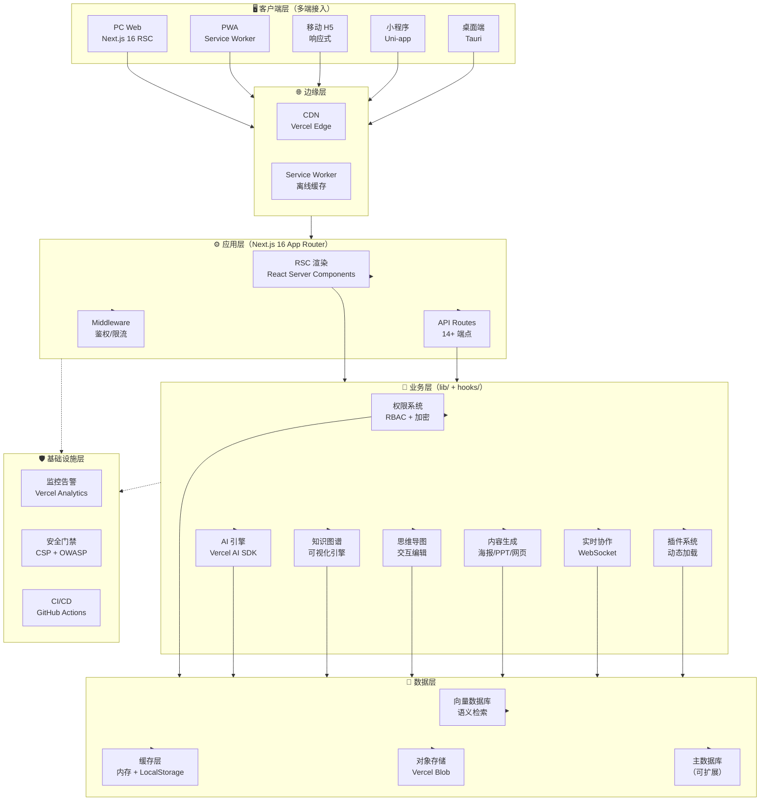

---

## 二、五维驱动架构体系

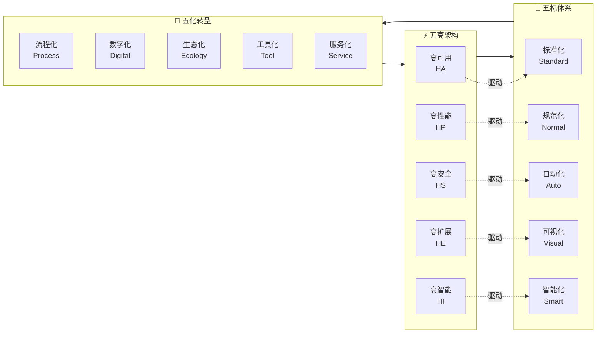

---

## 三、技术栈分层架构

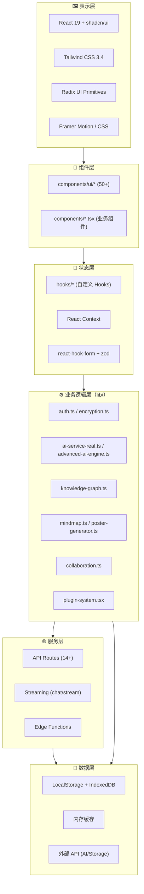

---

## 四、数据流图（Request Lifecycle）

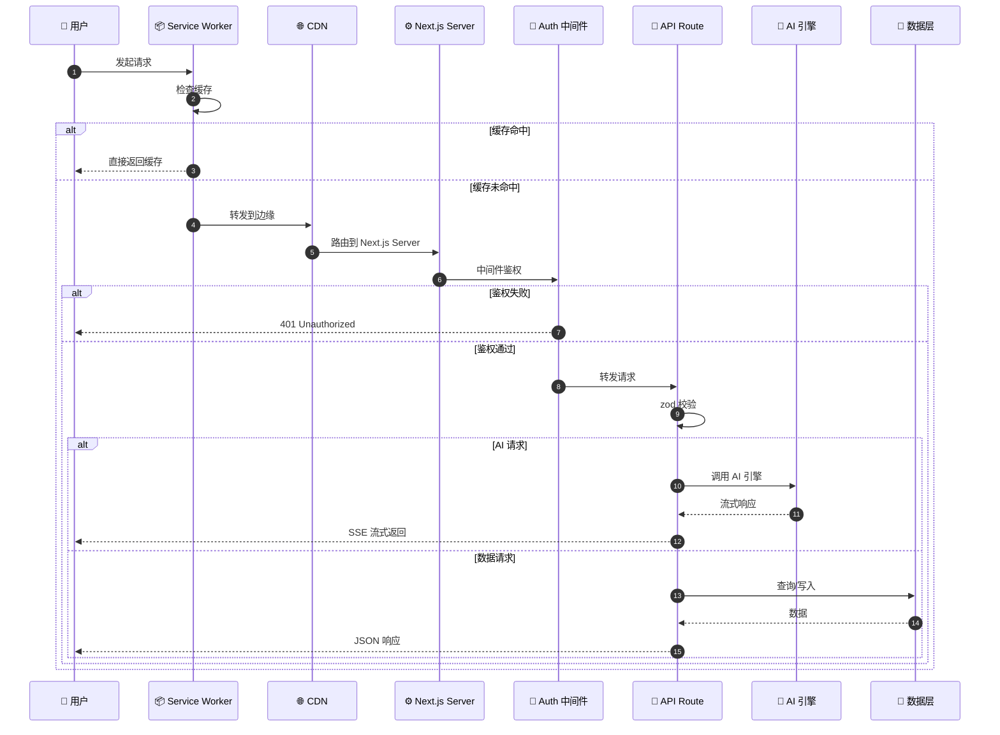

---

## 五、状态管理架构

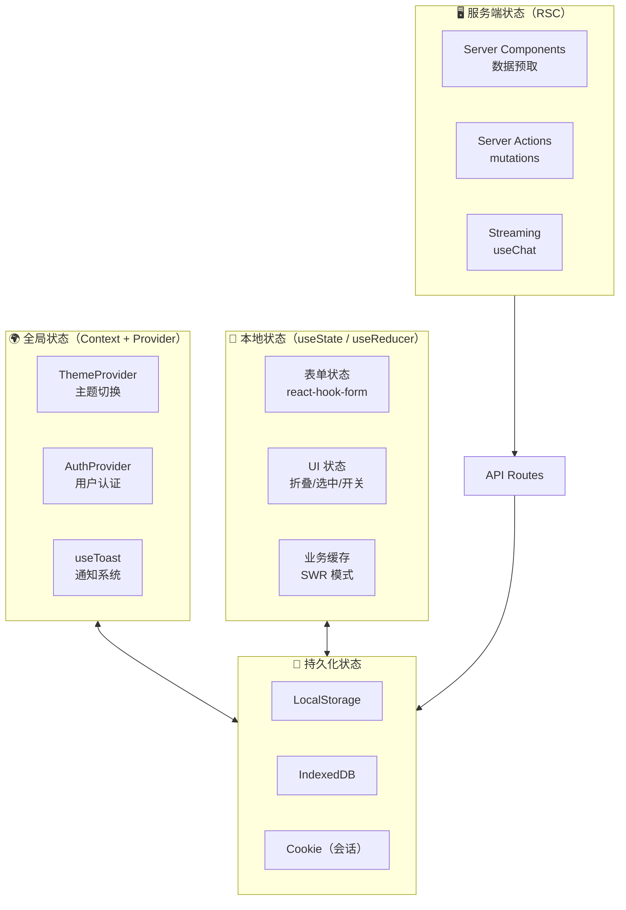

---

## 六、模块依赖关系图

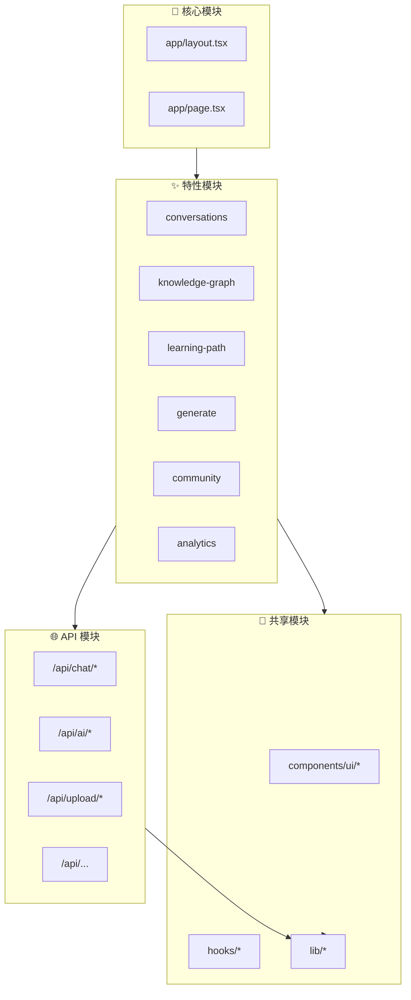

---

## 七、CI/CD 流水线架构

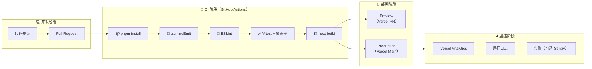

---

## 八、测试金字塔

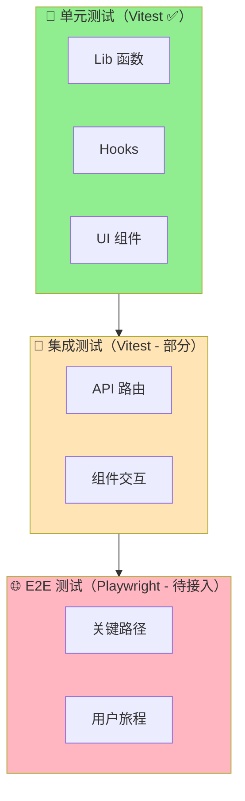

**当前进度**：

- ✅ 单元测试：3 个测试文件（`utils.test.ts` / `use-mobile.test.tsx` / `button.test.tsx`），共 14 个用例
- 🔄 集成测试：规划中
- ⏳ E2E 测试：未接入（Playwright 待评估）

---

## 九、安全架构（Defense in Depth）

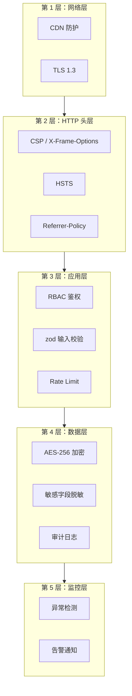

---

## 十、部署拓扑

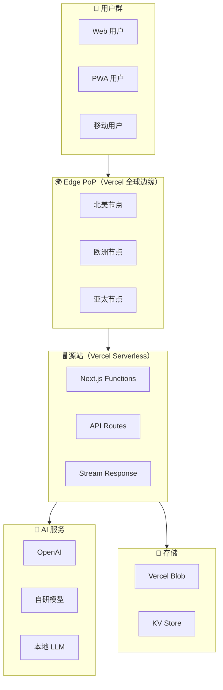

---

## 十一、版本演进路线图

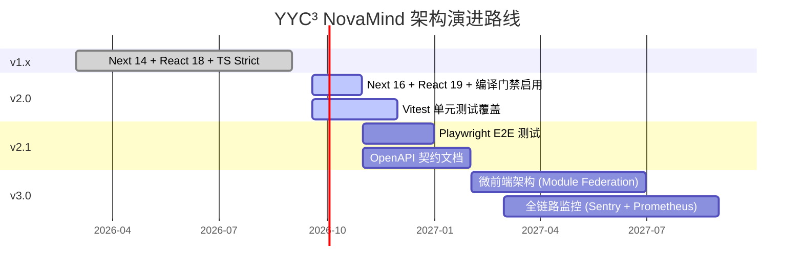

---

## 十二、关键架构决策记录（ADR 摘要）

| 编号 | 决策 | 背景 | 备选方案 | 状态 |
| :--- | :--- | :--- | :--- | :--- |
| ADR-001 | 使用 Next.js 16 App Router | RSC + 流式响应 + 内置优化 | Remix / SvelteKit | ✅ 已采纳 |
| ADR-002 | React 19 同步升级 | useFormStatus / useOptimistic / Server Actions | 保留 React 18 | ✅ 已采纳 |
| ADR-003 | shadcn/ui + Radix UI | 可定制 + 无障碍 + 社区活跃 | Material UI / Ant Design | ✅ 已采纳 |
| ADR-004 | Vitest 替代 Jest | 与 Vite 生态一致 + 更快 | Jest / Mocha | ✅ 已采纳 |
| ADR-005 | 启用 TS 编译门禁 | 杜绝 ignoreBuildErrors=true 偷懒 | 持续忽略（已弃用） | ✅ 已采纳 |
| ADR-006 | 端口统一 3200+ | 远离受限端口 + 团队规范 | 保留 3074 | ✅ 已采纳（用户裁决） |
| ADR-007 | pnpm 9 + frozen-lockfile | 依赖确定性 + 安装速度 | npm / yarn | ✅ 已采纳 |
| ADR-008 | GitHub Actions CI | 零成本 + 生态完善 | GitLab CI / Jenkins | ✅ 已采纳 |

---

## 附录 A：Mermaid 渲染支持

本文档使用 [Mermaid](https://mermaid.js.org/) 语法描述架构图。下列平台已验证可正确渲染：

- ✅ GitHub Markdown（自动渲染）
- ✅ VS Code（`Markdown Preview Mermaid Support` 插件）
- ✅ GitLab Markdown
- ✅ Typora（Pro 版）
- ✅ Obsidian（核心插件）
- ⚠️ 部分 IDE 需安装插件

## 附录 B：变更历史

| 版本   | 日期       | 作者                  | 变更内容                                      |
| ------ | ---------- | --------------------- | --------------------------------------------- |
| v1.0.0 | 2026-09-18 | AI Tutor (MiniMax-M3) | 初稿：12 张 Mermaid 图 + ADR 表 + 版本路线图  |

---

> ***YanYuCloudCube***
> *言启象限 | 语枢未来*
> ***Words Initiate Quadrants, Language Serves as Core for Future***
> *万象归元于云枢 | 深栈智启新纪元*
> ***All things converge in cloud pivot; Deep stacks ignite a new era of intelligence***

---

**文档维护**: 如需更新本文档，请遵循 YYC³ 团队通用开发文档规范，并记录变更历史。
**反馈渠道**: 如有任何改进建议，欢迎联系 admin@0379.email。

> 「***YanYuCloudCube***」
> 「***<admin@0379.email>***」
> 「***Words Initiate Quadrants, Language Serves as Core for the Future***」
> 「***All things converge in cloud pivot; Deep stacks ignite a new era of intelligence***」
**© 2025-2026 YanYuCloudCube™. All Rights Reserved.**

